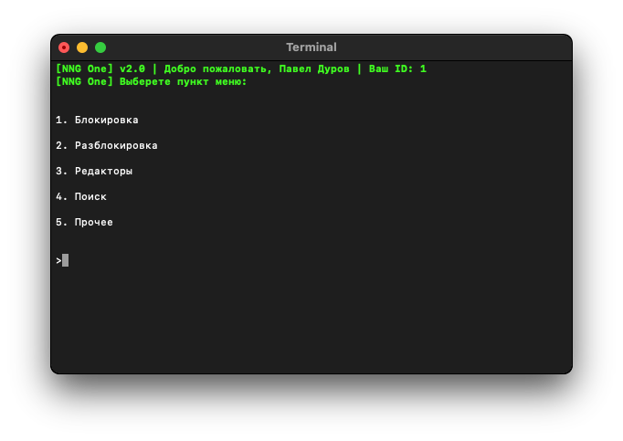

    

        
    

    
nng one

   

# 🤔 Что это такое?

Это скрпит позволяющий автоматизировать управление сообществами для комментирования записей ВКонтакте.

    

# ✨ Возможности скрипта

1. Выполнение массовых действий
    1. Блокировка пользователя или пользователей
    2. Разблокировка пользователя или пользователей
    3. Выдача редактора пользователю или пользователям
    4. Снятие всех редакторов в сообществе
    5. Преобразование screen_name в ID
    6. Удаление всех записей со стены в сообществе или сообществах
    7. Репост записи из основной группы в сообщества
2. Возможность поиска
    1. Заблокированных редакторов в сообществе или сообществах (и последующая их блокировка)
    2. Определённого редактора в сообществе или сообществах
3. Вывод статистики по сообществам (с учётом и без учёта заблокированных страниц)
    1. Общее количество подписчиков
    2. Общее количество редакторов
4. Выполнение некоторых действий без капчи

# 📚 Ресурсы

- [👨‍⚖️ Политика конфиденциальности](https://github.com/likhner/nng-one/wiki/👨‍⚖️-Политика-конфиденциальности)
- [💡 Документация](https://github.com/likhner/nng-one/wiki)
- [🐞 Баг трекер](https://github.com/likhner/nng-one/issues)
- [📄 Лицензия](LICENSE)
